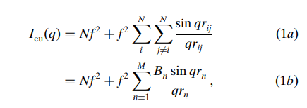

# Debye-scattering-equation-in-a-more-computationally-efficient-form

This r code applies DSE model in a computationally efficient form by using the equation given in **figure 1b** below. The error is negligible (if the bin size is small (0.001 in the R code)) by this approximation when compared with actual DSE equation in **figure 1a**. For more information, please read the below reference. 

reference: Scardi, P. & Billinge, Simon & Neder, R. & Cervellino, Antonio. (2016). Celebrating 100 years of the Debye scattering equation. Acta Crystallographica Section A Foundations and Advances. 72. 589-590. 10.1107/S2053273316015680. 

